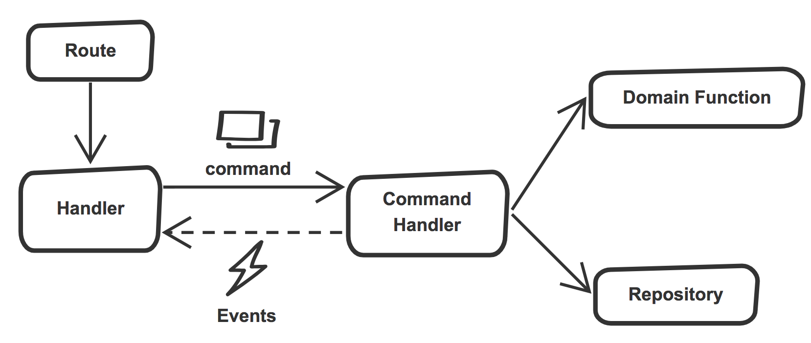

# node-commander-pattern



It's a todo practice for implementing a command pattern in Node.js by TypeScript and Inversify.js

## Project Structure

```
root
│
└───src
│   │   app.ts (main entry point)
│   │   inversify.config.ts (Config for Inversify)
│   │
│   └───api (API routes and handler, group by resource)
|   |   └───XXX
│   │        │   handler.ts
│   │        │   route.ts
│   |
│   └───commandHandler (Command handler, group by resource)
|   |   └───XXX
│   │        │   query.ts
│   │        
│   └───commands (Command, group by resource)
|   |   └───XXX
│   │        │   query.ts
│   │        
│   └───domains (Domain Functions)
│   │
│   └───entities (Entity)
│   │   
│   └───interfaces (Interface definition)
|   |   └───api
|   |   └───commandHandler
|   |   └───repository
│   │
│   └───repository (Repository)           
└───dist
```

## Getting Started

### Start Service

```sh
$ git clone https://github.com/AllenFang/node-commander-pattern.git
$ cd node-commander-pattern
$ yarn install
$ docker-compose build
$ docker-compose up -d
```

### Stop Service

```sh
$ docker-compose stop
```

### Remove Docker Container

This will clean all the container!

```sh
$ docker-compose down
```

### Launch to workspace container

```sh
$ docker-compose run workspace sh
```

### Postgres Admin

Go to http://localhost:8080

* DataBase System: PostgreSQL
* Server: postgres
* User: postgres
* Password: 123456
* DataBase: postgres

## APIs

You can check all the routes from `src/api/**/routes.ts`

### User

- Fetch User: GET http://localhost:3001/user/1

### Todo List

- Fetch All Todo List: GET http://localhost:3001/todoList
- Fetch Todo List: GET http://localhost:3001/todoList/1
- Create Todo List: PUT http://localhost:3001/todoList

### Todo Item

- Fetch Todo Item: GET http://localhost:3001/todoItem/1
- Fetch All Todo Item: GET http://localhost:3001/todoItem/
- Create Todo Item: PUT http://localhost:3001/todoItem/1

## Todos

- [ ] Tests
- [ ] Finish todo basic logic
- [ ] Implement Complex Logic
- [ ] Production
- [ ] Enhance Dev env
- [ ] Integrate [typeorm](https://github.com/typeorm/typeorm)